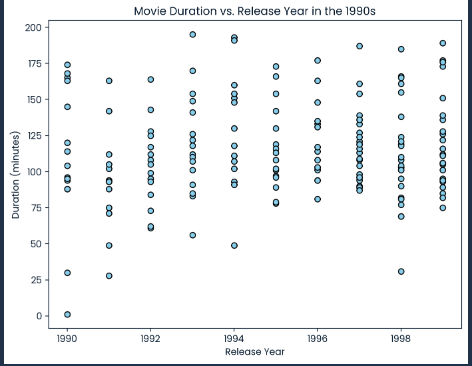

# Netflix Data Analysis: 1990s Movie Trends

Welcome to this **Exploratory Data Analysis (EDA)** project where we explore Netflix's movie data, focusing on the **1990s** decade. The goal of this project is to uncover key insights into movie durations and trends during that period. Specifically, we will:

1. Identify the **most frequent movie duration** in the 1990s.
2. Count the number of **short action movies** (movies with durations under 90 minutes) from the 1990s.

---

## Dataset Overview

We utilized a dataset named **netflix_data.csv**, which contains several important columns about each movie or show, such as:

- **show_id**: Unique identifier for each show.
- **type**: The type of show (Movie or TV Show).
- **title**: The title of the show.
- **director**: The director of the show.
- **duration**: Duration of the show in minutes.
- **genre**: Genre of the show (e.g., Action, Drama, etc.).
- **release_year**: The year the show was released on Netflix.

This dataset was filtered for **movies released in the 1990s**, specifically between **1990 and 1999**.

---

## Step 1: Filtering Data for the 1990s

The first step in our analysis was to filter the dataset to only include movies from the 1990s. Using the **release_year** column, we selected movies that were released between **1990 and 1999**.

This helped us focus on the movies that are relevant to our analysis of 1990s cinema.

---

## Step 2: Most Frequent Movie Duration

One of the key goals of the project was to determine the **most frequent movie duration** in the 1990s. We calculated the **mode** of the `duration` column, which provides us with the most common movie length in the 1990s.

### Result:

The **most frequent movie duration** in the 1990s was found to be **90 minutes**.

This suggests that many movies from the 1990s were around the 90-minute mark, which aligns with the general trend of feature films during this era.

---

## Step 3: Counting Short Action Movies

We also wanted to identify how many **short action movies** were released in the 1990s. For our analysis, we defined **short movies** as those with a duration of **less than 90 minutes**.

After filtering the dataset for **action genre** and checking the **duration**, we counted how many of these short action movies were released during the 1990s.

### Result:

We found that there were **72 short action movies** released in the 1990s.

This shows that despite the general trend of movies being around 90 minutes, there was still a notable number of short action movies released during that decade.

---

## Conclusion

This project provided several insights into the movie trends of the 1990s, including:

- The **most frequent movie duration** was **90 minutes**.
- A total of **72 short action movies** were released in the 1990s.

These findings are valuable for anyone interested in 1990s cinema, especially those who focus on trends in movie durations and the popularity of short action films during that era.

---

## Visualization Example: Duration vs. Release Year Scatter Plot

Here is a scatter plot showcasing movie durations versus release years for the 1990s.

---

## Tools and Libraries Used

- **Pandas**: For data manipulation and analysis.
- **Matplotlib**: For visualizing the results with histograms and bar charts.

If you would like to explore more, feel free to modify the analysis to look at other genres, release years, or movie features.

---
